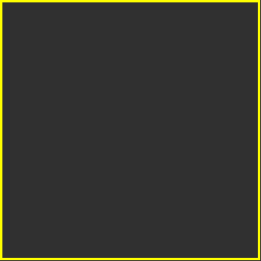

<div id="top"></div>

<!-- PROJECT LOGO -->
<br />
<div align="center">
  <a href="https://github.com/github_username/repo_name">
    
  </a>

<h3 align="center">Aqua2D</h3>

  <p align="center">
    2D Top-down game creation tool using HTML5
    <br />
    <a href="https://github.com/Crystal4B/Aqua2D"><strong>Explore the docs »</strong></a>
    <br />
    <br />
    <a href="https://github.com/Crystal4B/Aqua2D">View Demo</a>
    ·
    <a href="https://github.com/Crystal4B/Aqua2D/issues">Report Bug</a>
    ·
    <a href="https://github.com/Crystal4B/Aqua2D/issues">Request Feature</a>
  </p>
</div>


<!-- TABLE OF CONTENTS -->
<details>
  <summary>Table of Contents</summary>
  <ol>
    <li>
      <a href="#about-the-project">About The Project</a>
      <ul>
        <li><a href="#built-with">Built With</a></li>
      </ul>
    </li>
    <li>
      <a href="#getting-started">Getting Started</a>
      <ul>
        <li><a href="#prerequisites">Prerequisites</a></li>
        <li><a href="#installation">Installation</a></li>
      </ul>
    </li>
    <li><a href="#usage">Usage</a></li>
    <li><a href="#roadmap">Roadmap</a></li>
    <li><a href="#contributing">Contributing</a></li>
    <li><a href="#license">License</a></li>
    <li><a href="#contact">Contact</a></li>
    <li><a href="#acknowledgments">Acknowledgments</a></li>
  </ol>
</details>


<!-- ABOUT THE PROJECT -->
## About The Project

[![Product Name Screen Shot][product-screenshot]](https://example.com)

<p align="right">(<a href="#top">back to top</a>)</p>


### Built With

* [React.js](https://reactjs.org/)
* [Electron](https://www.electronjs.org/)
* [Typescript](https://www.typescriptlang.org/)

<p align="right">(<a href="#top">back to top</a>)</p>


<!-- GETTING STARTED -->
## Getting Started

This is a quick startup guide for setting up the project locally.
To get a copy of the project locally and start up the application follow these simple steps.

### Prerequisites

* npm
  ```
  npm install npm@latest -g
  ```

### Installation

1. Clone the repo
   ```
   git clone https://github.com/Crystal4B/Aqua2D.git
   ```
2. Install NPM packages
   ```
   npm install
   ```
3. Run Application
   - Web
      ```
      npm run start:web
      ```
   - Desktop
      ```
      npm run start:desktop
      ```

<p align="right">(<a href="#top">back to top</a>)</p>


<!-- USAGE EXAMPLES -->
## Usage

Use this space to show useful examples of how a project can be used. Additional screenshots, code examples and demos work well in this space. You may also link to more resources.

_For more examples, please refer to the [Documentation](https://example.com)_

<p align="right">(<a href="#top">back to top</a>)</p>


<!-- ROADMAP -->
## Roadmap

- [ ] Feature 1
- [ ] Feature 2
- [ ] Feature 3
    - [ ] Nested Feature

See the [open issues](https://github.com/Crystal4B/Aqua2D/issues) for a full list of proposed features (and known issues).

<p align="right">(<a href="#top">back to top</a>)</p>

<!-- LICENSE -->
## License

Distributed under the MIT License. See `LICENSE.md` for more information.

<p align="right">(<a href="#top">back to top</a>)</p>


<!-- CONTACT -->
## Contact

Marcin Sęk - 18254187@studentmail.ul.ie

Project Link: [https://github.com/Crystal4B/Aqua2D/](https://github.com/Crystal4B/Aqua2D/)

<p align="right">(<a href="#top">back to top</a>)</p>


<!-- ACKNOWLEDGMENTS -->
## Acknowledgments

* [React Icons](https://react-icons.github.io/react-icons/search)

<p align="right">(<a href="#top">back to top</a>)</p>

[product-screenshot]: images/screenshot.png
